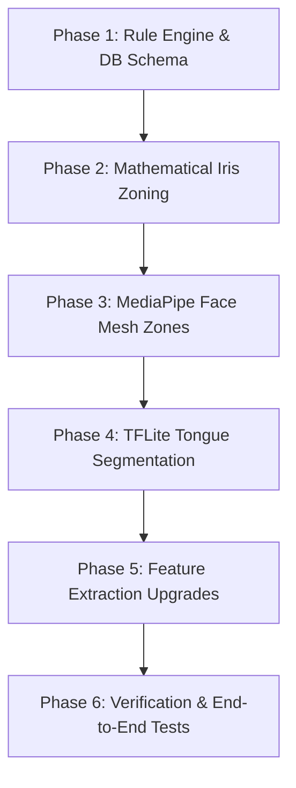

# A-EYE AI Analysis Service - Next Phase Implementation Plan

This document details the step-by-step roadmap to transition the A-EYE service from its current skeletal implementation to a production-ready, feature-complete system. It also outlines the architecture for a practitioner-facing frontend tool to define zoning rules, and how the backend pipeline will process and evaluate them.

---

## 1. Goal Description

Implement the required high-fidelity computer vision algorithms, segmentation engines, and mathematical partitioning systems for Iris, Face, and Tongue analysis as defined in the `srs.md`. Concurrently, provide a clear blueprint for a Practitioner Rule Builder interface (Frontend tools, API payloads, and Backend evaluation).

---

## 2. User Review Required

> [!IMPORTANT]
> **TensorFlow Lite Model for Tongue**: A pretrained tongue segmentation model (`.tflite`) is required. We must decide if we will use an open-source DeepLabv3 tongue model or a custom UNet model converted to TFLite.
> 
> **MediaPipe JS SDK vs Backend Extraction**: For the Face Mesh, we recommend extracting the 468 landmarks on the *frontend* (using the browser WebGL-accelerated MediaPipe library) and sending landmarks alongside the image to reduce server load and improve immediate client responsiveness. Let us know if you prefer to keep face mesh processing purely backend-only.

---

## 3. Proposed Architecture & System Design

### Frontend Rule Builder (Tools & Techniques)

Practitioners need a visual way to define rules like: *“If redness in the Tip of the Tongue > 0.7, trigger the digestive stress pattern finding.”*

#### Frontend Visual Tooling
1. **Interactive Overlays (SVG/Canvas)**:
   - **Iris**: A dynamic SVG showing 3 rings and 12 segments centered over a template eye. Clicking a segment highlights it and selects it for the rule context.
   - **Tongue**: An SVG path outline dividing the region into `Tip`, `Center`, `Left`, `Right`, and `Rear`.
   - **Face**: A WebGL canvas rendering the MediaPipe Face Mesh. Clicking predefined clusters (e.g. forehead indices `10`, `338`, `297` etc.) highlights that zone.
2. **Visual Rule Query Builder**:
   - Use a library like `react-query-builder` or build a custom dropdown builder:
     - **Field**: `redness`, `brightness`, `roughness`, `uniformity`, `spots`, `cracks`
     - **Operator**: `>`, `<`, `>=`, `<=`, `==`, `!=`
     - **Value**: Slider input (0.0 to 1.0) or boolean toggle.

#### API Payload for Rules
When a practitioner saves a rule, it is sent to the backend with this structure:
```json
{
  "scan_type": "tongue",
  "zone": "tip",
  "condition": "redness > 0.75 AND cracks == true",
  "finding": "cardiac heat pattern",
  "severity": "medium",
  "description": "Indicates elevated circulation or irritation in the tip region."
}
```

---

## 4. Step-by-Step Implementation Plan



### Phase 1: Rule Engine & Database Alignment
Align the database schemas and make the expression evaluator robust enough to parse logical operators (`AND`, `OR`).

#### [MODIFY] [rule.py](file:///home/sabuj/Office/a-eye-fastapi/app/db/models/rule.py)
- Expand rules model properties (if not already matching) to match the incoming frontend payload.

#### [MODIFY] [rule_engine.py](file:///home/sabuj/Office/a-eye-fastapi/app/services/rule_engine.py)
- Upgrade `safe_eval_condition` to support logical operators: `ast.And` (`and`), `ast.Or` (`or`), and `ast.Not` (`not`).
- Ensure it properly maps fields like `redness`, `texture` (roughness/uniformity), `spots`, and `cracks` to the condition environment context.

---

### Phase 2: Mathematical Iris Zoning (36 Zones)
Implement the mathematical division of the iris into concentric rings and segment sectors.

#### [MODIFY] [zoning.py](file:///home/sabuj/Office/a-eye-fastapi/app/services/analysis_pipeline/zoning.py)
- Calculate pupil/iris boundaries:
  - Input: Bounding circle from Hough Circle Transform `(cx, cy, r_iris)`.
  - Assume approximate pupil radius `r_pupil = r_iris * 0.35` (or detect both circles).
- Map **3 Rings**:
  - Ring 1 (Inner): $r_{pupil}$ to $r_{pupil} + \frac{1}{3}(r_{iris} - r_{pupil})$
  - Ring 2 (Middle): $r_{pupil} + \frac{1}{3}(r_{iris} - r_{pupil})$ to $r_{pupil} + \frac{2}{3}(r_{iris} - r_{pupil})$
  - Ring 3 (Outer): $r_{pupil} + \frac{2}{3}(r_{iris} - r_{pupil})$ to $r_{iris}$
- Map **12 Segments** (Angular partitions):
  - Divide $360^\circ$ into 12 segments of $30^\circ$ each, starting from top ($90^\circ$).
- Output: 36 mathematical polygon coordinates representing `ring_[1-3]_segment_[1-12]` to be stored as `zone_regions`.

---

### Phase 3: MediaPipe Face Mesh Zones (468 Landmarks)
Map the face mesh coordinates to physiological zones.

#### [MODIFY] [detection.py](file:///home/sabuj/Office/a-eye-fastapi/app/services/analysis_pipeline/detection.py)
- Update `detect_face` to extract and return the raw 468 landmark coordinates $(x, y)$ mapped to pixel space.

#### [MODIFY] [zoning.py](file:///home/sabuj/Office/a-eye-fastapi/app/services/analysis_pipeline/zoning.py)
- Group landmarks into predefined index zones:
  - **Forehead**: Landmarks surrounding the forehead.
  - **Left/Right Cheeks**: Landmark indices corresponding to zygomatic regions.
  - **Nose / Chin / Mouth**: Respective index segments.
- Construct convex hulls using OpenCV (`cv2.convexHull`) from these landmark groups to generate boundary polygon coordinates for each face zone.

---

### Phase 4: TFLite Tongue Segmentation
Integrate the ML model to segment the tongue region.

#### [NEW] [ml_models/tongue_segmentation.tflite](file:///home/sabuj/Office/a-eye-fastapi/ml_models/tongue_segmentation.tflite)
- Store the lightweight tongue segmentation model file.

#### [MODIFY] [detection.py](file:///home/sabuj/Office/a-eye-fastapi/app/services/analysis_pipeline/detection.py)
- Implement `detect_tongue` using `tflite_runtime.interpreter`:
  - Load the model, preprocess the input image (resize, normalize scale).
  - Run inference to get the probability mask.
  - Apply thresholding to output a clean binary mask.

#### [MODIFY] [zoning.py](file:///home/sabuj/Office/a-eye-fastapi/app/services/analysis_pipeline/zoning.py)
- Find the centroid and orientation of the segmented tongue mask.
- Partition the bounding box of the tongue mask relative to its orientation:
  - **Tip**: Lowest 20% along the tongue axis.
  - **Rear**: Top 20% of the tongue axis.
  - **Center**: Mid region.
  - **Left/Right**: Sides of the mid region.

---

### Phase 5: Advanced Feature Extraction
Implement the physical feature extraction algorithms requested in the SRS.

#### [MODIFY] [feature_extraction.py](file:///home/sabuj/Office/a-eye-fastapi/app/services/analysis_pipeline/feature_extraction.py)
1. **Color Spaces**:
   - Extract Mean/Std for HSL/HSV and CIELAB (`cv2.COLOR_BGR2LAB`) within each zone's polygon.
2. **Texture (GLCM / LBP)**:
   - Implement Gray-Level Co-occurrence Matrix (GLCM) contrast, energy, homogeneity metrics, or Local Binary Patterns (LBP) to calculate `roughness` and `uniformity`.
3. **Spot Detection**:
   - Apply Difference of Gaussians (DoG) or Laplacian of Gaussians (LoG) to isolate localized dark spots or light spots in each zone.
4. **Crack / Fissure Detection**:
   - Apply Frangi vesselness filter or custom Hessian-based line filters to highlight linear structures (cracks/fissures), returning a boolean score if crack density exceeds a threshold.

---

### Phase 6: Safety Filter Alignment
Verify compliance restrictions.

#### [MODIFY] [protocol_engine.py](file:///home/sabuj/Office/a-eye-fastapi/app/services/protocol_engine.py)
- Update `BLOCKED_WORDS` to include: `diagnose, diagnosis, treat, treatment, cure, prescribe, prescription, medical advice` to ensure regulatory compliance.

---

## 5. Verification Plan

### Automated Tests
- **Unit Tests**:
  - Run `pytest tests/` to verify mathematical partitioning of the circle.
  - Verify that `safe_eval_condition` accurately evaluates formulas with `AND`/`OR` logic.
  - Verify that the safety filter correctly redacts all medical keywords.
- **Mock Integration Tests**:
  - Mock TFLite and MediaPipe outputs using static numpy fixtures to ensure the zoning pipeline is resilient.

### Manual Verification
- Deploy the updated endpoints.
- Submit actual tongue, face, and iris images via Postman/cURL, and verify that:
  - All 36 zones are successfully extracted for iris scans.
  - Custom rules created with the schema trigger correctly and return matching report recommendations.
